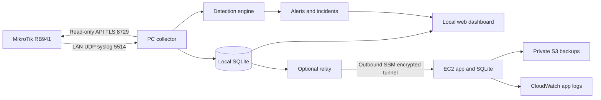

<h1 align="center">MikroSOC</h1>
<p align="center"><strong>Network visibility and security operations for your MikroTik RouterBOARD.</strong><br>Python · Flask · SQLite · RouterOS API TLS · Syslog</p>
<p align="center"><a href="https://monsurhadi.github.io/MikroSOC/">Interactive demo</a> · <a href="SETUP.md">Windows & router setup</a> · <a href="PAGES-DEMO.md">Publish the showcase</a> · <a href="docs/OPERATIONS.md">Operations guide</a></p>

> [!IMPORTANT]
> **The GitHub Pages website is a DEMO TEMPLATE / interactive showcase, not a live monitoring deployment.** Its charts, devices, alerts and responses use synthetic data. It does not connect to a real router, run the Python backend, or inspect anyone's network.
>
> **For real monitoring, pair a locally running MikroSOC instance with your physical MikroTik RouterBOARD.** The application runs on your PC or server; the router supplies telemetry through API TLS and syslog. Opening the public demo alone does not pair your router.

## Why MikroSOC

MikroSOC brings network monitoring and a small SOC investigation workflow into one learning project. Start with router health and bandwidth, then investigate security events, document incidents and practice controlled response.

- **Built around physical hardware:** a MikroTik RB941-2nD supplies the lab telemetry.
- **Two connected workflows:** network visibility first, security detection and incident handling second.
- **Local setup:** Python and SQLite run on your computer with no required cloud subscription.
- **Reviewable response:** optional source-address blocking requires administrator confirmation and produces audit records.
- **Easy to explore:** the public showcase lets visitors try the interface without credentials or a router.

## Choose how to run it

| Mode | Where it runs | Data source | Physical router required? |
| --- | --- | --- | --- |
| Public showcase | GitHub Pages, in your browser | Synthetic JavaScript fixtures; changes stay in browser storage | No; it cannot connect to one |
| Local Python demo | PC/server at `127.0.0.1:8000` | Seeded demo database | No |
| Local live monitoring | PC/server on your router's network | RouterOS API TLS and incoming syslog | **Yes** |
| Optional cloud relay | Local collector plus AWS app | Telemetry forwarded by the local collector | Yes, for live router data |

In the public showcase you can acknowledge alerts, edit incidents, review devices, search sample logs, adjust example rule settings and export demo CSV reports. Blocking and unblocking are simulations. **Reset demo** restores the examples. Do not enter private investigation details into a public showcase browser session.

## What is included

| Phase | Implemented capability |
| --- | --- |
| 1 Network monitoring | CPU, memory, uptime, WAN upload/download history, interface status, DHCP device inventory, syslog search, password login |
| 1 Cloud path | Terraform VPC/EC2/IAM/S3/CloudWatch infrastructure, systemd service, outbound PC relay through AWS Session Manager |
| 2 Detection | Port scanning, failed logins, possible SSH username enumeration, new DHCP devices, sustained WAN upload anomalies |
| 2 Operations | Severity, alert acknowledgement, incident stages, assignees, investigation notes, CSV reporting, device trust labels |
| 2 Response | Preview commands, optional administrator-confirmed one-hour source blocking, per-incident unblock, audit history |
| 2 Access | Admin, analyst and viewer roles; user creation/disable/role changes; password changes and CLI recovery |
| 2 Optional integrations | SMTP STARTTLS email alerts with retries; offline CIDR country/ASN/reputation enrichment |

The implementation is intentionally **one router and one organization per instance**. You can run separate instances with separate databases and ports. A shared multi-router tenancy UI, SNMP polling, automatic external GeoIP/AbuseIPDB queries, OpenSearch and packet inspection are not implemented. API polling provides the NOC metrics in this release. The earlier planning notes list alternatives and future options; they are not all required dependencies.

## Quick start in VS Code (local Python demo)

Install Git, Python 3.12 and VS Code. Clone this repository and open it:

```powershell
git clone https://github.com/monsurhadi/MikroSOC.git
cd MikroSOC
code .
```

From the project folder in the VS Code PowerShell terminal:

```powershell
py -3.12 -m venv .venv
.\.venv\Scripts\python.exe -m pip install -r requirements.txt
.\.venv\Scripts\python.exe manage.py init
.\.venv\Scripts\python.exe manage.py demo
.\.venv\Scripts\python.exe manage.py run
```

Open <http://127.0.0.1:8000>. Sign in with the administrator you created. There is no default password. Demo fixtures produce all five detection types without scanning or contacting a router. Demo samples are static, and real-time counters remain zero until a message arrives.

## Pair with your physical RouterBOARD

The target lab uses an **RB941-2nD**; the supplied router output reports **RouterOS 6.49.13**. This identifies the lab configuration, not a recommendation to remain on that version. Physical connectivity and certificate validation must pass before you can call the deployment live.

Follow [SETUP.md](SETUP.md) in order:

1. Run the local Python demo and verify the dashboard works.
2. Connect the PC to the router's LAN and identify the actual PC address, router address and WAN interface. Reserve the PC's DHCP lease.
3. Back up the router configuration before making changes.
4. Configure a dedicated monitoring user with `read,api` permissions.
5. Complete **section 7: API TLS**. Assign a signed server certificate to `api-ssl`, trust its issuing CA on the PC and verify the router address against the certificate. `certificate=none` is not ready for verified TLS monitoring.
6. Limit API TLS access to the monitoring PC and configure router syslog forwarding to that PC.
7. Switch the local application's configuration to live mode using a separate live database, then start the service.
8. Verify that a successful poll fills CPU, memory, bandwidth and device inventory, and that new router logs reach **Live logs**.

| Connection | Purpose |
| --- | --- |
| PC → router, TCP `8729` | RouterOS binary API over verified TLS |
| Router → PC, UDP `5514` | LAN syslog collection |
| Browser → local PC, HTTP `127.0.0.1:8000` | Local application interface |

Use your own network addresses in the setup guide. Keep API services restricted to the management network. The RB941 supplies telemetry; it does not host the Python application, database or public showcase. Optional write access for response is configured separately from the read-only monitoring account.

## Detection and investigation

| Detection | Evidence used | Interpretation |
| --- | --- | --- |
| Possible port scan | Logged connection activity | Logging coverage and thresholds affect visibility |
| Repeated login failures | Authentication failure logs | Investigate misconfiguration as well as hostile attempts |
| Possible SSH enumeration | Relevant SSH failure events | A signal for investigation, not proof of compromise |
| New DHCP device | DHCP inventory changes | Review and label trusted devices |
| Sustained upload anomaly | WAN traffic measurements | High upload alone does not prove data exfiltration |

Alerts support acknowledgement and incident records with severity, assignee and notes. Incidents move through detection, investigation, containment, recovery, lessons learned and closure. Optional live response supports previewed, administrator-confirmed one-hour source blocks and per-incident unblock; the public showcase only records simulated actions.

## Current boundaries and future extensions

Endpoint detection, Wazuh agents, Suricata/Zeek packet analysis, PCAP inspection, SNMP polling and shared multi-router management are **not implemented in this release**. They are possible future integrations, not features demonstrated by sample alerts. Endpoint telemetry would need an endpoint agent; packet inspection would need a separate sensor with access to the traffic.

The project is designed for a lab and portfolio. Detection quality depends on available logs, polling intervals and configuration. It does not claim production SIEM coverage or verified acceptance on every RouterOS model/version.

## Publish the GitHub Pages demo

See [PAGES-DEMO.md](PAGES-DEMO.md). The workflow publishes only the `showcase/` directory. After merging, choose **Settings → Pages → Source → GitHub Actions**, then run **Deploy MikroSOC showcase** if needed.

Expected showcase address: **https://monsurhadi.github.io/MikroSOC/**. Deployment must succeed before that address shows the new interface. Python, private configuration, certificates and databases are not part of the Pages artifact.

## Architecture



Local and cloud run the same application. Router credentials remain on the PC. The EC2 security group has no inbound rules, and both web applications bind to loopback. A separate authenticated ingestion endpoint accepts relayed observations in cloud mode. Stop either copy independently; the local dashboard continues working without AWS.

## Repository guide

- [Windows and router setup](SETUP.md)
- [AWS deployment and teardown](docs/AWS.md)
- [Operational guide, email and intelligence](docs/OPERATIONS.md)
- [Design, schema and API](docs/DESIGN.md)
- [Two-phase learning roadmap](docs/ROADMAP.md)
- [Folder structure](docs/FOLDER_STRUCTURE.md)
- [Validation and known limits](docs/VALIDATION.md)
- [Sources and MikroDash comparison](docs/SOURCES.md)

## Development

```powershell
.\.venv\Scripts\python.exe -m unittest discover -s tests -v
```

Stack: Python, Flask, Waitress, SQLite, plain JavaScript/CSS and SVG charts. No Node build step, Docker, database server or paid threat-intelligence account is needed. The implementation uses structured RouterOS API words rather than shell commands.

The local UI is refreshed every 15 seconds; router polling defaults to 60 seconds. Those are distinct intervals. Start only **one application process per database and syslog port**. Multiple WSGI worker processes would duplicate collection and detection and are not supported.

## Cost and scope

Local software has no subscription fees; you supply the PC, router, electricity and Internet connection. AWS is optional and billable outside the credits/limits applicable to your account. The package does not promise perpetual free EC2, public IPv4, storage or CloudWatch. No cloud resources have been created by this project build.

This is a functional lab/portfolio platform, not a replacement for a staffed SOC or a production SIEM. UDP logs can be lost or spoofed on a trusted LAN; sampled logs and DHCP snapshots have blind spots. Physical-router acceptance and AWS deployment are steps you perform using the included guide.

## Demo and live deployment reminder

**The public live page is a demo template showcasing MikroSOC. To monitor a real network, install and run the application on a PC/server and pair it with your MikroTik RouterBOARD using the setup guide. Demo data is not evidence of a connected or protected router.**
