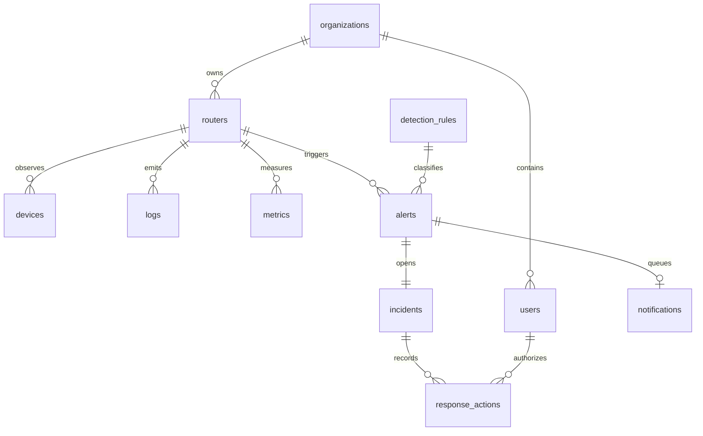

# Design and implementation reference

## Requirements interpretation

The supplied DOCX is an outline naming seven modules, nine data entities, five detections and an incident workflow. It does not contain detailed acceptance criteria or complete SQL. This implementation makes concrete choices: Python/Flask/Waitress, SQLite, one router per instance, 60-second API polling, UDP syslog, manual response and explicit local/cloud modes. The supplied planning notes describe cloud options and later enhancements; unsupported options are listed honestly in README.

## Module boundaries

`manage.py` owns initialization, local account recovery, service startup, diagnostic polling and backup. `config.py` validates IPs, ports and mode. `routeros.py` implements framed synchronous RouterOS sentences with bounded responses and verified TLS. `collector.py` handles UDP intake, bounded queue, parsing worker, polling, maintenance and optional email worker. `detection.py` converts observations into thresholded alerts and incidents. `web.py` exposes authenticated routes and serves the static UI. `response.py` performs only named address-list operations with an explicitly configured responder. `cloud.py` accepts authenticated, deduplicated observations. `scripts/relay.py` moves observations without router secrets.

SQLite uses WAL, foreign keys and short-lived per-operation connections. There is no external message broker. The listener queue holds 5,000 datagrams; overflow increments a visible drop counter. One ingestion worker keeps local detection order deterministic. API polling uses one connection per cycle and selected properties to limit work on the RB941. Collectors are threads within a single service process, not Flask debug/reloader workers.

## Entity model



Authoritative SQL is `SCHEMA` in `mikrosoc/db.py`. `meta` records mode/router identity; `ingress_receipts` deduplicates cloud event IDs. Audit stores actor/action/details separately. Logs reference the router; optional device attribution is not invented when a firewall record cannot reliably map an IP to a device. The outline's devices→logs chain is therefore represented as router-scoped evidence rather than an incorrect mandatory relationship.

| Table | Important fields |
| --- | --- |
| users | username, password_hash, role, active, org_id |
| routers | name, ip, status, last_poll, last_syslog, baseline |
| devices | router_id + MAC unique, IP, hostname, first_seen, last_seen, trusted |
| logs | receipt time, kind, source/destination IPv4, destination port, username, raw message |
| detection_rules | key, enabled, threshold, window, severity, cooldown |
| alerts | rule, source, severity, title, evidence JSON, acknowledgement state |
| incidents | unique alert, stage, assignee, notes, updated time |
| response_actions | incident, user, target, action, status, detail |
| metrics | sample time, CPU, memory, uptime, interval rates, interface JSON |
| notifications | alert, delivery state, attempt count, retry time |
| audit | event time, actor, action, detail |

## API

All browser APIs use the signed session cookie; POST requests require `X-CSRF-Token` from `/api/session`. There is no public JWT or unauthenticated router API proxy. JSON payloads are capped at 64 KiB. CSV export is read-only but audited.

| Method | Path | Access and behavior |
| --- | --- | --- |
| GET | `/api/session` | CSRF bootstrap and current identity |
| POST | `/api/login`, `/api/logout` | Login/logout; login rate limit 10 attempts/minute per peer |
| GET | `/api/overview` | Authenticated router health, metric history and counts |
| GET | `/api/logs?q=&before=` | Authenticated search/keyset pagination, 100 rows |
| GET | `/api/alerts`, `/api/incidents`, `/api/devices` | Authenticated latest 200 records |
| GET | `/api/rules`, `/api/response_actions` | Authenticated configuration/history |
| GET | `/api/users`, `/api/audit` | Administrator only |
| POST | `/api/alerts/{id}/ack` | Analyst/admin acknowledge |
| POST | `/api/incidents/{id}` | Analyst/admin stage, assignee and notes |
| POST | `/api/devices/{id}/trust` | Analyst/admin trust label |
| POST | `/api/rules/{key}` | Admin validated rule configuration |
| POST | `/api/users`, `/api/users/{id}` | Admin create or role/active changes |
| POST | `/api/password` | Current password plus new password; signs out current browser |
| GET | `/api/report/{kind}.csv` | Authenticated export up to 10,000 rows |
| GET | `/api/incidents/{id}/response` | Analyst/admin validated command preview |
| POST | `/api/incidents/{id}/response` | Admin plus typed confirmation; config/TLS gate |
| GET | `/api/intelligence/{address}` | Authenticated offline CIDR lookup |
| POST | `/api/ingest` | Cloud only; independent bearer token, no browser CSRF requirement |

Example incident body:

```json
{"stage":"investigation","assignee":"analyst1","notes":"Reviewed source and router logs; awaiting device owner confirmation."}
```

Cloud event contract:

```json
{
  "event_id": "persistent-node-id:log:123",
  "router_ip": "192.168.88.1",
  "observed_at": 1789730000,
  "kind": "log",
  "payload": {"message":"Example observation; replace timestamp with current Unix seconds"}
}
```

The timestamp is illustrative. Ingestion allows the preceding seven days and up to five minutes of forward clock skew. Dedupe receipts expire after eight days. One transaction covers receipt insertion and database/detection effects. A relay token is powerful: it can create monitoring evidence, so keep it secret. No cloud event executes router commands.

## Failure handling and limits

API timeouts mark the router unreachable without blocking the UI. A counter reset or excessive sample gap yields null rates. UDP overflow is counted and dropped. Database retention removes raw evidence while preserving compact alert evidence. SMTP retries are bounded. Response timeouts record an uncertain outcome because a command may already have reached the router. Relay checkpoints commit only after cloud acknowledgement; retention can still remove unforwarded history.

The design is single-node and single-router. It has no HA, distributed locking, immutable external audit, enterprise identity, secrets vault, MFA or guaranteed log delivery. It is intended for a private portfolio lab and its explicitly described cloud tunnel deployment.
